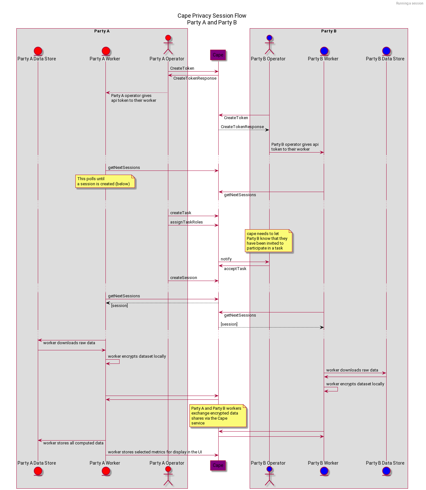

# Cape Workers

Cape workers are Docker images that can be built and run in the environment of your choice.

Each party collaborating on training a model using Cape will deploy a separate cape worker as a Docker container.

Cape workers are designed to facilitate the sharing of datasets between each other using public-key encryption, while keeping all other data isolated to the context of each customized, containerized service.



## Prerequisites
- [Docker](https://docs.docker.com/)
- A Cape Cloud Account
- A Cape Cloud [organization token](/understand/features/tokens)
- An S3 bucket for retrieving data

### Supported SHA Commits
`bcc4e3b`

## Starting your `cape-worker` instance

Starting your Cape worker is as simple as running a Docker image using `docker run`:
```shell
  export CAPE_TOKEN=my-cape-org-token
  docker run -d --rm                                  \
    --name cape-worker                                \
    -e CAPE_TOKEN                                     \
    -e CAPE_BUCKET=my-s3-bucket-location              \
    -e CAPE_COORDINATOR=https://app.capeprivacy.com   \
    -e CAPE_BROKER=https://app.capeprivacy.com/broker \
    -e AWS_ACCESS_KEY_ID                              \
    -e AWS_SECRET_ACCESS_KEY                          \
    -e AWS_REGION                                     \
    capeprivacy/cape-worker:sha-1234567
```

In this command:

- `cape-worker` is the name you want to assign your container.
- `my-cape-org-token` is your [Cape organization token](/understand/features/tokens).
- `s3-bucket-location` is the URI of the S3 bucket that you would like Cape to write the results of the computation to.
- `sha-1234567` is the commit SHA specifying the commit you would like to use to run your worker.

## Environment Variables
When you run the cape-worker image, you can specify the following environment variables, either by passing on the `docker run` command, or by setting them in a separate `.env` file. Refer to the Docker documentation for options for [configuring Docker environment variables](https://docs.docker.com/compose/environment-variables/#pass-environment-variables-to-containers).

### **`CAPE_TOKEN`** (required)
This is your Cape organization token. You can generate Cape organization tokens from your "Organization Settings"  in the Cape UI.

Refer to our [tokens usage documentation](/understand/features/tokens/) for more information on how tokens are used in Cape.

### **`CAPE_BUCKET`**
Set this variable to the URI of the S3 bucket that you would like Cape to write the results of the computation to. By setting this variable, you will overwrite the [S3 bucket model location specified when submitting your job using **pycape**](/libraries/pycape/usage/job/#setting-the-storage-location-as-a-model-owner-in-cape).

Currently, Cape only supports writing to Amazon S3 blob storage. In order for your cape-worker to authenticate and communicate with your S3 bucket, you'll need to let your instance know about the following AWS configuration variables.

### **`AWS_ACCESS_KEY_ID`**
Set this to the AWS access key associated with an IAM user that has s3 write permissions to the location specified by `CAPE_BUCKET`.

This variable is only required if your container doesn't already have S3 permissions, for example if you run your container on an EC2 instance using an IAM role that has the correct permissions.

### **`AWS_SECRET_ACCESS_KEY`** 
Set this to the secret key associated with the access key. This is essentially the "password" for the access key.

This variable is only required if your container doesn't already have S3 permissions, for example if you run your container on an EC2 instance using an IAM role that has the correct permissions.

### **`AWS_REGION`** 
Set this to the AWS Region you would like to send the request to.

!!!Note
	These AWS configuration variables line up with the AWS CLI environment variables. For up-to-date info on these variables, refer to the [AWS documentation](https://docs.aws.amazon.com/cli/latest/userguide/cli-configure-envvars.html).

## (Optional) Configure your container to restart automatically

Add the flag `--restart unless-stopped` to your docker command-line when launching your container to have it restart automatically. Alternatively, use a process manager like [supervisor](http://supervisord.org/) or [systemd](https://freedesktop.org/wiki/Software/systemd/) if you need more control. For more information, refer to the [Docker documentation](https://docs.docker.com/config/containers/start-containers-automatically/).

## (Optional) Send your logs to an aggregation service like AWS CloudWatch

It is highly recommended that you send container logs to a log aggregation service. For example, if the worker is running in an AWS environment, the Docker daemon or the individual container can send logs directly to AWS CloudWatch. See [here](https://docs.docker.com/config/containers/logging/awslogs/) for detailed documentation, along with other drivers provided by docker.
