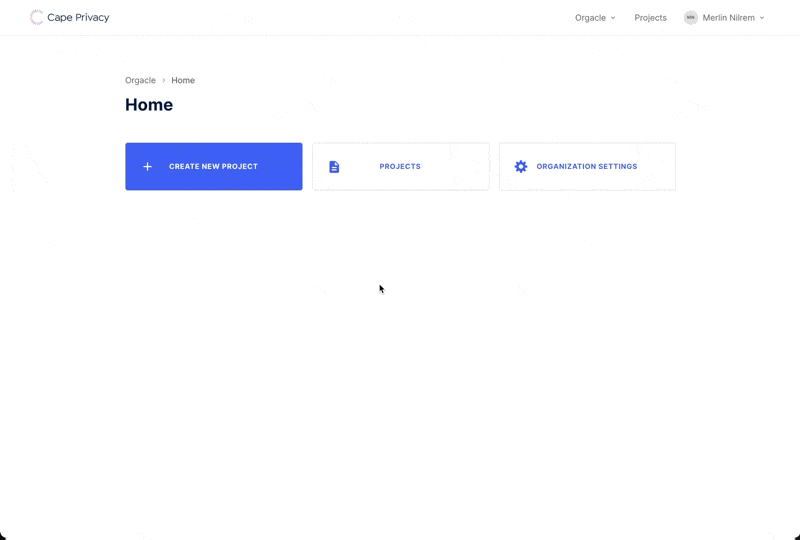

# Tokens

In Cape there are two types of tokens that can be created to authenticate with different parts of Cape's architecture- user tokens and organization tokens.

## User Tokens
Individual user tokens are used to identify you to the Cape Coordinator, so you can register [`DataViews`](/libraries/cape-ds/reference/#dataview), create and run Cape [`Jobs`](/libraries/cape-ds/reference/#job) and perform other necessary functions. See the [cape-ds Usage docs](/libraries/cape-ds/usage/login) for instructions on how to use your user token to log into the [cape-ds Python library](/libraries/cape-ds).

User tokens can be generated from your _User Settings_.

## Organization Tokens
Organizational tokens are used to run [Cape Workers](/understand/architecture/cape-workers/). These tokens facilitate the secure sharing of data across all workers that are collaborating on a project using Cape privacy. and are stored as environment variables.

Organizational tokens can be generated from your _Organization Settings_.

